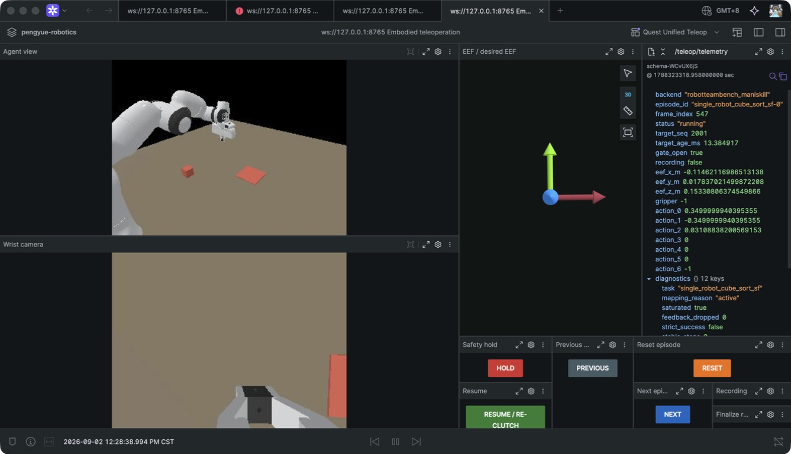
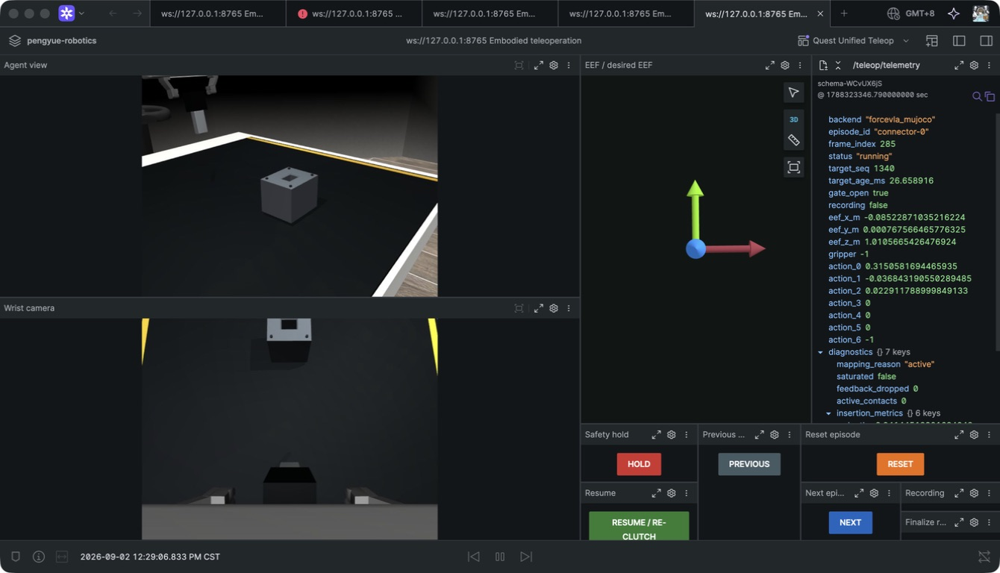

# Unified Quest teleoperation

The maintained collection path has one UI and one internal transport:

```text
Quest APK -> tracker hub -> embodied.teleop_target/v1 (ZMQ PUB 8130)
                                  |
                         ManiSkill or MuJoCo
                                  |
          feedback + Agent/wrist JPEG (ZMQ PUB 8131)
                                  |
                         Foxglove gateway (8765)
                                  |
                    Foxglove Quest Unified Teleop

Foxglove services -> command/result (ZMQ DEALER/ROUTER 8132) -> backend
```

Foxglove is the only collection UI. The calibration browser is deliberately
separate because it edits a Quest-owned calibration profile before collection;
it never controls a simulator. There is no MJPEG dashboard, Operator Panel, or
stdin command path in the maintained stack.

## One-time setup

```bash
scripts/setup.sh
../RobotTeamBench/scripts/setup_quest_teleop_mac.sh
../forceVLA-mujoco/scripts/setup_quest_teleop_env.sh
```

## Calibration and physical collection

Create one profile for each physical setup:

```bash
scripts/run_calibration.sh desk
```

Then start one complete session:

```bash
# ManiSkill
scripts/run_quest_session.sh \
  --backend maniskill \
  --profile desk \
  --task cube_sort \
  --scene-seed 17001 \
  --record

# MuJoCo
scripts/run_quest_session.sh \
  --backend mujoco \
  --profile desk \
  --record
```

The launcher starts/rechecks the FrankaBot APK, runs the device doctor, binds
the raw Quest ports in the tracker hub, starts the selected backend, starts the
Foxglove SDK gateway, and opens the organization layout. Exiting the backend or
interrupting the launcher stops the complete child-process set.

It waits up to 120 seconds for an authorized Quest by default, so the practical
sequence is simply: power/wake Quest, connect USB, run the command, wear the
headset, pick up the right controller, then press `B` to clutch.
`--adb-wait-seconds N` changes the startup wait. During a session, the hub restores reverse ports
and FrankaBot focus after an ADB reconnect without restarting the simulator.

Do wear the headset while controlling. Meta can leave ADB and the controller
radio connected while marking the controller `CONNECTED_INACTIVE`; in that
state the app receives no usable 6DoF pose. If tracking drops, the backend
freezes Cartesian motion. Pick up the right controller and wave it in the
headset's view. Recovery requires six consecutive valid frames and then
re-anchors controller-to-EEF motion at the current pose, so a reacquisition
jump cannot make the arm chase its pre-dropout target.

Real collection refuses a missing calibration profile. The doctor verifies
ADB, authorization, APK/activity, reverse ports, and calibration geometry.
Physical pose signs, trigger behavior, and human-operable gains still require a
controller-in-hand check.

Quest/Unity reports controller poses in a left-handed world frame. Position
calibration intentionally preserves the operator's physical right, forward,
and up directions even when that basis has determinant -1. Controller
orientations use a full basis conjugation, so the canonical target still emits
a proper determinant-1 rotation for robotics backends.

## No-controller validation

The same launcher can substitute a deterministic canonical target publisher:

```bash
scripts/run_quest_session.sh \
  --backend maniskill \
  --synthetic \
  --task cube_sort \
  --max-steps 80

scripts/run_quest_session.sh \
  --backend mujoco \
  --synthetic \
  --max-steps 80
```

Synthetic mode exercises the ZMQ subscriber, mapper, simulator, feedback,
cameras, Foxglove gateway, and cleanup. It cannot certify the physical Quest
axes, tracking focus, B-button clutch, trigger, or calibration.

## Foxglove surface

The official SDK gateway listens at `ws://127.0.0.1:8765`. The organization
layout is `Quest Unified Teleop` (`lay_0eaTLQSSPmExnWfB`); its versioned export
is `foxglove/quest_teleop.foxglove-layout.json`.

Topics:

- `/teleop/agent_view`
- `/teleop/wrist_camera`
- `/teleop/eef_pose`
- `/teleop/desired_eef_pose`
- `/teleop/controller_target`
- `/teleop/telemetry`
- `/teleop/target`
- `/teleop/source_status`
- `/teleop/diagnostics` (`diagnostic_msgs/msg/DiagnosticArray`)

Services:

- `/teleop/hold`, `/teleop/resume`
- `/teleop/episode/previous`, `/teleop/episode/reset`, `/teleop/episode/next`
- `/teleop/recording/start`, `/teleop/recording/stop`,
  `/teleop/recording/discard`

Every service waits for an `embodied.teleop_command_result/v1` response. The
backend remains the safety authority and duplicate request IDs are never
applied twice.

The default layout renders `/teleop/diagnostics` with Foxglove's Diagnostics
Summary and Diagnostic Detail panels. `Teleop/Workflow` gives one plain-language
state plus the next operator action. `Teleop/Safety` carries only the guard
evidence needed to explain a hold or recovery. Raw JSON topics remain available
for engineering plots but are not part of the operator layout.

Interactive ManiSkill collection disables the environment's registered
700-step timeout. A completed or explicitly timed episode enters Hold and waits
for Previous, Reset, or Next; it never advances to another scene on its own.
Use `--episode-max-steps N` only when a deliberate timeout is useful.

Default tracking protection is fail-closed: 250 ms target timeout, six-frame
recovery, rejection of a controller step over 6 cm, 1 mm positional deadband,
50 ms smoothing, and a 0.5 m/s guarded target slew limit. Both backends also
apply their own workspace and native-action limits. These values are CLI
options when a task needs deliberate tuning.

The same layout is shared by both maintained simulator backends:





## Ownership

- Quest repository: APK parsing, ADB, calibration, target publication, session
  composition, and the Foxglove gateway/layout.
- `embodied-ops`: canonical schemas, ZMQ transport, and the source-neutral
  Cartesian dropout/reacquisition guard.
- Backend repository: clutch configuration, workspace/action limits, native action,
  task reset/navigation, cameras, recording, and command acknowledgement.
- Foxglove: visualization and semantic service requests; never raw actuator
  authority.

Only `embodied.teleop_target/v1`, `embodied.teleop_feedback/v1`,
`embodied.teleop_command/v1`, and `embodied.teleop_command_result/v1` are
accepted. Older Quest-prefixed schemas are rejected instead of upgraded.

## Synchronized records

Both backends write pre-action `agent_view.mp4` and `wrist.mp4` plus one JSONL
row per native action. Each row contains the canonical target, timing, action,
EEF/proprioception, camera indexes, watchdog/hold reason, and saturation
diagnostics. Clean completion atomically renames partial files and writes a
complete manifest. MuJoCo additionally preserves every 500 Hz physics substep
in HDF5.
